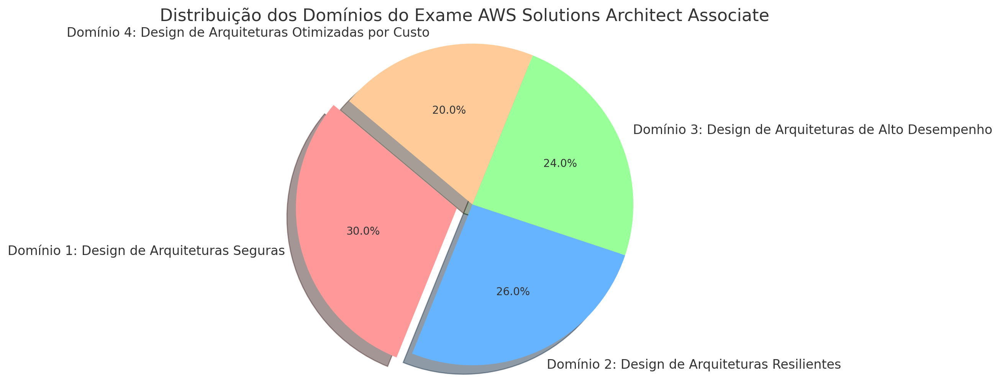

# AWS Solutions Architect Associate Study Guide

## Language Options

  <a href="#portuguese-guide" class="btn btn-primary">🇧🇷 Versão em Português</a>
  <a href="#english-guide" class="btn btn-primary">🇺🇸 English Version</a>

---

# Guia de Estudo AWS Solutions Architect Associate (Português)

## 📜 Introdução

Bem-vindo ao guia de estudo para o exame AWS Solutions Architect Associate. Este recurso foi desenvolvido para proporcionar uma preparação eficaz, oferecendo uma estrutura clara e recursos abrangentes para cada etapa do processo de aprendizado.

## 🎯 Benefícios da Certificação

- **Validação de Competências**: Confirma sua expertise em arquitetar e implementar soluções seguras na AWS
- **Reconhecimento Profissional**: Aumenta sua credibilidade no mercado de cloud computing
- **Oportunidades de Carreira**: Expande suas possibilidades profissionais
- **Aprendizado Profundo**: Aprofunda seu conhecimento em serviços AWS e melhores práticas

## 📚 Conteúdo Programático

### 📅 Cronograma de Estudos (8 Semanas)

| Semana | Domínio | Material |
|--------|---------|----------|
| [Semana 1: Introdução](docs/pt/etapas/semana1.md) | [Domínio 1: Arquiteturas Seguras](docs/pt/dominio/design-arquiteturas-seguras.md) | [📊 Slides](docs/pt/slides/semana1.md) |
| [Semana 2: Arquiteturas Seguras I](docs/pt/etapas/semana2.md) | [Domínio 1](docs/pt/dominio/design-arquiteturas-seguras.md) | [📊 Slides](docs/pt/slides/semana2.md) |
| [Semana 3: Arquiteturas Seguras II](docs/pt/etapas/semana3.md) | [Domínio 1](docs/pt/dominio/design-arquiteturas-seguras.md) | [📊 Slides](docs/pt/slides/semana3.md) |
| [Semana 4: Arquiteturas Resilientes I](docs/pt/etapas/semana4.md) | [Domínio 2](docs/pt/dominio/design-arquiteturas-resilientes.md) | [📊 Slides](docs/pt/slides/semana4.md) |
| [Semana 5: Arquiteturas Resilientes II](docs/pt/etapas/semana5.md) | [Domínio 2](docs/pt/dominio/design-arquiteturas-resilientes.md) | [📊 Slides](docs/pt/slides/semana5.md) |
| [Semana 6: Alto Desempenho](docs/pt/etapas/semana6.md) | [Domínio 3](docs/pt/dominio/design-arquiteturas-alto-desempenho.md) | [📊 Slides](docs/pt/slides/semana6.md) |
| [Semana 7: Otimização de Custos](docs/pt/etapas/semana7.md) | [Domínio 4](docs/pt/dominio/design-arquiteturas-otimizadas-custo.md) | [📊 Slides](docs/pt/slides/semana7.md) |
| [Semana 8: Revisão](docs/pt/etapas/semana8.md) | Revisão Geral | [📊 Slides](docs/pt/slides/semana8.md) |

### 📊 Distribuição do Exame

{: .img-fluid}

- **Domínio 1**: Arquiteturas Seguras (30%)
- **Domínio 2**: Arquiteturas Resilientes (26%)
- **Domínio 3**: Arquiteturas de Alto Desempenho (24%)
- **Domínio 4**: Otimização de Custos (20%)

---

# AWS Solutions Architect Associate Study Guide (English)

## 📜 Introduction

Welcome to the AWS Solutions Architect Associate exam study guide. This comprehensive resource is designed to help you prepare effectively through structured learning and practical resources.

## 🎯 Certification Benefits

- **Skill Validation**: Demonstrate your AWS architecture expertise
- **Professional Recognition**: Enhance your cloud computing credibility
- **Career Growth**: Access new professional opportunities
- **Deep Understanding**: Master AWS services and best practices

## 📚 Study Plan

### 📅 8-Week Schedule

| Week | Domain | Resources |
|------|--------|-----------|
| [Week 1: Introduction](docs/en/weeks/week1.md) | [Domain 1: Secure Architectures](docs/en/domains/secure-architectures.md) | [📊 Slides](docs/en/slides/week1.md) |
| [Week 2: Secure Architectures I](docs/en/weeks/week2.md) | [Domain 1](docs/en/domains/secure-architectures.md) | [📊 Slides](docs/en/slides/week2.md) |
| [Week 3: Secure Architectures II](docs/en/weeks/week3.md) | [Domain 1](docs/en/domains/secure-architectures.md) | [📊 Slides](docs/en/slides/week3.md) |
| [Week 4: Resilient Architectures I](docs/en/weeks/week4.md) | [Domain 2](docs/en/domains/resilient-architectures.md) | [📊 Slides](docs/en/slides/week4.md) |
| [Week 5: Resilient Architectures II](docs/en/weeks/week5.md) | [Domain 2](docs/en/domains/resilient-architectures.md) | [📊 Slides](docs/en/slides/week5.md) |
| [Week 6: High Performance](docs/en/weeks/week6.md) | [Domain 3](docs/en/domains/high-performance.md) | [📊 Slides](docs/en/slides/week6.md) |
| [Week 7: Cost Optimization](docs/en/weeks/week7.md) | [Domain 4](docs/en/domains/cost-optimization.md) | [📊 Slides](docs/en/slides/week7.md) |
| [Week 8: Review](docs/en/weeks/week8.md) | Final Review | [📊 Slides](docs/en/slides/week8.md) |

### 📊 Exam Distribution

{: .img-fluid}

- **Domain 1**: Secure Architectures (30%)
- **Domain 2**: Resilient Architectures (26%)
- **Domain 3**: High-Performance Architectures (24%)
- **Domain 4**: Cost-Optimized Architectures (20%)

# 🎓 Preparação AWS Solutions Architect Associate

    <h2>Guia de Estudos Completo</h2>
    
Prepare-se para a certificação AWS Solutions Architect Associate com nosso guia estruturado

## 📚 Módulos de Estudo

    <!-- Semana 1 -->
    

        

            🌟
            <h3>Semana 1</h3>
        

        

            <h4>Introdução à AWS</h4>
            
Fundamentos e Conceitos Básicos

            <a href="docs/pt/slides/semana1.md" class="module-link">Acessar Material ➡️</a>
        

    

    <!-- Semana 2 -->
    

        

            🔧
            <h3>Semana 2</h3>
        

        

            <h4>Serviços Fundamentais</h4>
            
EC2, S3, VPC e Mais

            <a href="docs/pt/slides/semana2.md" class="module-link">Acessar Material ➡️</a>
        

    

    <!-- Semana 3 -->
    

        

            🛡️
            <h3>Semana 3</h3>
        

        

            <h4>Design de Arquiteturas Seguras</h4>
            
Domínio 1 - Fundamentos de Segurança

            <a href="docs/pt/slides/semana3.md" class="module-link">Acessar Material ➡️</a>
        

    

    <!-- Semana 4 -->
    

        

            🏗️
            <h3>Semana 4</h3>
        

        

            <h4>Arquiteturas Resilientes</h4>
            
Domínio 2 - Parte 1

            <a href="docs/pt/etapas/semana4.md" class="module-link">Acessar Material ➡️</a>
        

    

    <!-- Semana 5 -->
    

        

            🔄
            <h3>Semana 5</h3>
        

        

            <h4>Alta Disponibilidade</h4>
            
Domínio 2 - Parte 2

            <a href="docs/pt/etapas/semana5.md" class="module-link">Acessar Material ➡️</a>
        

    

    <!-- Semana 6 -->
    

        

            🚀
            <h3>Semana 6</h3>
        

        

            <h4>Alto Desempenho</h4>
            
Domínio 3 - Otimização

            <a href="docs/pt/etapas/semana6.md" class="module-link">Acessar Material ➡️</a>
        

    

    <!-- Semana 7 -->
    

        

            💰
            <h3>Semana 7</h3>
        

        

            <h4>Otimização de Custos</h4>
            
Domínio 4 - Eficiência

            <a href="docs/pt/etapas/semana7.md" class="module-link">Acessar Material ➡️</a>
        

    

    <!-- Semana 8 -->
    

        

            📝
            <h3>Semana 8</h3>
        

        

            <h4>Revisão Final</h4>
            
Preparação para o Exame

            <a href="docs/pt/etapas/semana8.md" class="module-link">Acessar Material ➡️</a>
        

    

