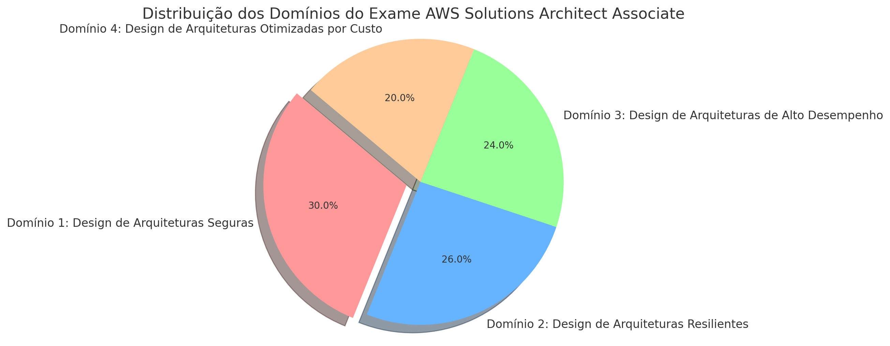

# Guia de Preparacao para o Exame AWS Solutions Architect Associate (SAA-C03)

> **Seu recurso completo para conquistar a certificacao AWS Solutions Architect Associate.** Este guia foi criado pela comunidade para oferecer um caminho estruturado de estudo, cobrindo todos os dominios do exame com materiais praticos, questoes de revisao e dicas de especialistas.

---

## Sobre o Exame

O exame **AWS Certified Solutions Architect - Associate (SAA-C03)** valida a capacidade de projetar e implementar solucoes distribuidas na AWS. E uma das certificacoes mais procuradas no mercado de cloud computing.

- **Codigo do Exame**: SAA-C03
- **Formato**: 65 questoes (multipla escolha e multipla resposta)
- **Duracao**: 130 minutos
- **Nota minima para aprovacao**: 720 de 1000
- **Custo**: USD 150
- **Idiomas disponiveis**: Ingles, Japones, Coreano, Portugues, Chines Simplificado, entre outros
- **Guia Oficial**: [AWS Certified Solutions Architect - Associate](https://aws.amazon.com/certification/certified-solutions-architect-associate/)

---

## Beneficios da Certificacao

- **Validacao de Competencias**: Confirma sua capacidade de arquitetar e implantar solucoes seguras e robustas na AWS
- **Reconhecimento Profissional**: Aumenta sua visibilidade e credibilidade no mercado de computacao em nuvem
- **Oportunidades de Carreira**: Abre portas para novas vagas e avancos na carreira, com salarios mais competitivos
- **Aprendizado Profundo**: Amplia seu conhecimento sobre os servicos AWS e melhores praticas de arquitetura
- **Acesso a Comunidade AWS**: Faz parte de uma rede global de profissionais certificados

---

## Cronograma de Estudo em 8 Partes

| Parte | Conteudo | Dominio | Slides |
|-------|----------|---------|--------|
| [Parte 1: Introducao](docs/pt/etapas/semana1.md) | Visao geral do exame e acesso seguro a recursos | [Dominio 1: Arquiteturas Seguras](docs/pt/dominio/design-aplicacoes-seguras.md) | [Slides Parte 1](docs/pt/slides/semana1.md) |
| [Parte 2: Workloads Seguras](docs/pt/etapas/semana2.md) | Projetar cargas de trabalho e aplicacoes seguras | [Dominio 1: Arquiteturas Seguras](docs/pt/dominio/design-aplicacoes-seguras.md) | [Slides Parte 2](docs/pt/slides/semana2.md) |
| [Parte 3: Seguranca de Dados](docs/pt/etapas/semana3.md) | Controles de seguranca de dados e criptografia | [Dominio 1: Arquiteturas Seguras](docs/pt/dominio/design-aplicacoes-seguras.md) | [Slides Parte 3](docs/pt/slides/semana3.md) |
| [Parte 4: Arquiteturas Escalaveis](docs/pt/etapas/semana4.md) | Arquiteturas escalaveis e fracamente acopladas | [Dominio 2: Arquiteturas Resilientes](docs/pt/dominio/design-arquiteturas-resilientes.md) | [Slides Parte 4](docs/pt/slides/semana4.md) |
| [Parte 5: Alta Disponibilidade](docs/pt/etapas/semana5.md) | Arquiteturas altamente disponiveis e tolerantes a falhas | [Dominio 2: Arquiteturas Resilientes](docs/pt/dominio/design-arquiteturas-resilientes.md) | [Slides Parte 5](docs/pt/slides/semana5.md) |
| [Parte 6: Alto Desempenho](docs/pt/etapas/semana6.md) | Armazenamento, computacao, banco de dados e rede | [Dominio 3: Alto Desempenho](docs/pt/dominio/design-arquiteturas-alto-desempenho.md) | [Slides Parte 6](docs/pt/slides/semana6.md) |
| [Parte 7: Otimizacao de Custos](docs/pt/etapas/semana7.md) | Solucoes otimizadas por custo em todas as areas | [Dominio 4: Otimizacao de Custos](docs/pt/dominio/design-arquiteturas-otimizadas-custo.md) | [Slides Parte 7](docs/pt/slides/semana7.md) |
| [Parte 8: Revisao e Exercicios](docs/pt/etapas/semana8.md) | Revisao geral e questoes praticas | Todos os dominios | [Slides Parte 8](docs/pt/slides/semana8.md) |

---

## Distribuicao dos Dominios no Exame

| Dominio | Peso no Exame | Descricao |
|---------|:-------------:|-----------|
| **Dominio 1**: Design de Arquiteturas Seguras | **30%** | Acesso seguro, workloads seguras, seguranca de dados |
| **Dominio 2**: Design de Arquiteturas Resilientes | **26%** | Escalabilidade, desacoplamento, alta disponibilidade, DR |
| **Dominio 3**: Design de Arquiteturas de Alto Desempenho | **24%** | Armazenamento, computacao, banco de dados, rede |
| **Dominio 4**: Design de Arquiteturas Otimizadas por Custo | **20%** | Otimizacao de armazenamento, computacao, banco de dados, rede |

> **Dica**: Invista mais tempo nos Dominios 1 e 2, que juntos representam **56%** do exame.

---

## Recursos Adicionais

- [Dicas de Estudo e Estrategias para o Exame](docs/pt/recursos-adicionais/dicas.md) - Estrategias comprovadas para maximizar sua preparacao
- [Checklist de Revisao Final](docs/pt/recursos-adicionais/revisao.md) - Verifique se voce cobriu todos os topicos antes do exame
- [Reflexoes e Boas Praticas](docs/pt/recursos-adicionais/reflexoes.md) - Insights sobre arquitetura AWS do mundo real

### Questoes de Pratica por Parte

| Parte | Questoes |
|-------|----------|
| Parte 1 | [Questoes - Acesso Seguro](docs/pt/recursos-adicionais/questoes/questoes-semana-1.md) |
| Parte 2 | [Questoes - Workloads Seguras](docs/pt/recursos-adicionais/questoes/questoes-semana-2.md) |
| Parte 3 | [Questoes - Seguranca de Dados](docs/pt/recursos-adicionais/questoes/questoes-semana-3.md) |
| Parte 4 | [Questoes - Arquiteturas Escalaveis](docs/pt/recursos-adicionais/questoes/questoes-semana-4.md) |
| Parte 5 | [Questoes - Alta Disponibilidade](docs/pt/recursos-adicionais/questoes/questoes-semana-5.md) |
| Parte 6 | [Questoes - Alto Desempenho](docs/pt/recursos-adicionais/questoes/questoes-semana-6.md) |
| Parte 7 | [Questoes - Otimizacao de Custos](docs/pt/recursos-adicionais/questoes/questoes-semana-7.md) |
| Parte 8 | [Questoes - Revisao Geral](docs/pt/recursos-adicionais/questoes/questoes-semana-8.md) |

---

## Links Uteis

- [Pagina Oficial da Certificacao AWS SAA-C03](https://aws.amazon.com/certification/certified-solutions-architect-associate/)
- [Guia do Exame AWS (PDF)](https://d1.awsstatic.com/training-and-certification/docs-sa-assoc/AWS-Certified-Solutions-Architect-Associate_Exam-Guide.pdf)
- [AWS Well-Architected Framework](https://docs.aws.amazon.com/wellarchitected/latest/framework/welcome.html)
- [AWS Architecture Center](https://aws.amazon.com/architecture/)
- [AWS Whitepapers & Guides](https://aws.amazon.com/whitepapers/)
- [AWS Free Tier](https://aws.amazon.com/free/) - Para praticar com servicos reais
- [AWS Skill Builder](https://skillbuilder.aws/) - Cursos oficiais gratuitos e pagos

---

## Como Contribuir

Este e um projeto open source e contribuicoes sao muito bem-vindas! Consulte o [CONTRIBUTING.md](CONTRIBUTING.md) para saber como participar.

---

Desejamos muito sucesso na sua jornada de preparacao para o exame AWS Solutions Architect Associate!
